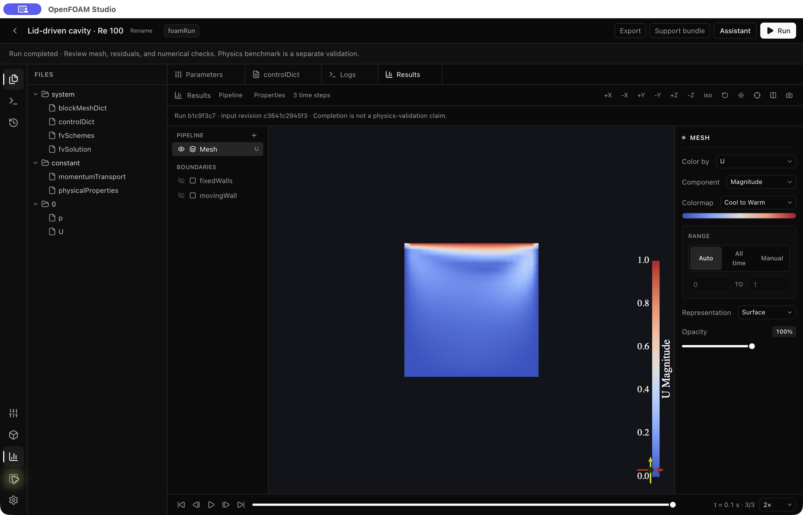

# OpenFOAM Studio: launch implementation follow-through

**8 October 2026 · Local implementation and ordered validation complete; public promotion remains gated**

The launch review has been translated into case-safety, execution, setup, renderer, and distribution changes without changing the prescribed architecture. This document distinguishes implemented source behavior from validated release claims. It does **not** close every original finding or authorize publication. Broad announcement remains gated by a reviewed immutable revision, clean-machine installer evidence, advertised provider journeys, and first-user observation.

The bounded target remains OpenFOAM 13 Foundation, laminar incompressible lid-driven cavity at Re=100. Codex CLI with `gpt-6.1-sol` is the unconfigured default. Users can select either Codex CLI or Claude Code CLI in Settings; explicit choices are preserved. API choices remain available; model availability and a successful response do not establish CFD performance. Turbulence, heat transfer, multiphase, arbitrary geometry, CAD import, optimization, and sweeps remain experimental.

## Provider-choice and setup follow-up

Both Codex CLI and Claude Code CLI are selectable in Settings. Saved Claude selections no longer migrate to Codex; provider and model survive reloads and switching. Connection tests, case generation/questions and diagnostic recovery dispatch to the selected provider with no automatic fallback. The live synthetic Claude/Sonnet connection probe failed on this machine and supplies login/model/version guidance; live Claude simulation generation is therefore not claimed. Existing Codex live evidence remains below.

Browser proof is saved in [dual-cli-settings.png](audit/2026-10-08/dual-cli-settings.png) and [setup-guidance.png](audit/2026-10-08/setup-guidance.png), with [follow-up smoke details](audit/2026-10-08/dual-cli-smoke.json). The screenshot-reported setup defect is corrected: guidance is wrapping prose, without a terminal prompt or copy button. Exact install/login/image commands are represented separately and individually copyable. Follow-up validation passed 281 unit regressions, all three typechecks, renderer/server builds, and the affected Stage 0 (15 checks). Stages 1–5 and native solver/chat evidence below were captured before this provider-choice/setup-only follow-up; those unchanged physics journeys were not repeated.

## Final local validation

The prescribed Stage 0 → 1 → 2 → 3 → 4 → 5 sequence was respected, with each failing stage corrected and rerun before advancing. Earlier failures are not counted as passes. Final local results on macOS ARM64:

| Check | Result | Scope |
| --- | --- | --- |
| Stage 0 · Environment/health | **15/15 passed** | Real Docker image/container, meshing, short solver execution, host log access, selected-provider readiness. |
| Stage 1 · Generation/recovery | **11/11 passed** | Actual restricted Codex/Sol generated eight OpenFOAM inputs; format and Re=100 checks passed. |
| Stage 2 · Mesh | **3/3 passed** | 400-cell cavity; blockMesh and checkMesh passed. |
| Stage 3 · Solver/recovery | **8/8 passed** | Actual solver advancement, fields, residuals, injected boundary failure and approved repair through the authenticated server. |
| Stage 4 · Cavity physics | **3/3 passed** | Re=100, 20×20×1 mesh, t=2 s. Maximum absolute normalized centerline velocity deviation **0.03205**, against a **0.15 absolute** tolerance; largest final sampled residual **1.78731×10⁻⁶**. |
| Stage 5 · Conversation/recovery | **9/9 passed** | Actual Codex/Sol three-turn generation, diagnostic repairs, and production HTTP explanation/refinement/clarification. Explanation preserved every input hash/name/revision; refinement changed only requested endTime; ambiguity created no invented files. |
| All unit regressions | **281/281 passed in 34 files** | Includes credential/job boundaries, strict patches, file conflicts, renderer stale events, restricted Codex dispatch, finite fields, authentic REST requests, exports and storage-failure rollback. |
| Core/server/renderer typechecks | **All passed** | Correct separate configurations; no Electron dependency in core. |
| Production renderer/server builds | **Passed** | Initial JS **348.00 kB / 106.04 kB gzip**, down from about 1.63 MB. Heavy viewer/editor chunks are on demand; only the required Monaco worker/syntax are shipped. |
| Packaged payload comparison | **Passed for ARM64 unpacked app** | Exact compiled server, Electron, core, renderer and starter hashes match the reviewed local build; local projects excluded. Installer and native smoke details below. |

There were meaningful corrections during this series: valid Foundation 13 time/continuity/trapping headers initially failed the new checks; the old Reviewer still invoked stopped Claude authentication; the legacy missing-wall test incorrectly expected a guessed physical velocity. The parser and selected-provider dispatch were fixed. The test now supplies the original engineer-confirmed lid velocity before repair. The Reviewer’s clarification was preserved as correct behavior.

The actual Codex-generated [validated cavity inputs](audit/2026-10-08/validated-cavity-inputs/system/controlDict) and their hashes are preserved for reproduction. Stage 4 changes endTime to 2 s; the separately bundled starter/native t=0.1 demonstration is not retroactively assigned that benchmark result.

Benchmark limits remain material: 17 reference points are loaded, 15 interior points compared, the sampled cell-center line is at normalized x=0.475, and near-wall endpoints are excluded. The 0.03205 result is normalized by lid speed; it is **not** a 3.205% relative error at every reference point and is not a general CFD certificate. Full runs record completion, finite fields and available continuity observations separately from `benchmark: not-run`. Runtime log evidence is bounded to the last 10,000 solver lines and its scope is stored in each run; complete streamed logs are saved separately.

Local validation used host Node **25.6.1** and the installed Docker OpenFOAM 13 image. Source development/CI declares Node 22; clean CI validation on that declared runtime is still required. Codex authentication was already available on this machine; fresh-account/API-provider journeys were not performed. All live model requests in this work used synthetic test prompts and disposable public cavity inputs, never existing user cases. Automatic review initially held Stage 5 for egress clarification and accepted it after the payload/destination boundary was verified.

Automatic PR checks run unit tests, types, builds and package-asset validation on Node 22. Full candidate validation is a separate required release dependency, with credential preflight and all Stage 0–5 in order. The repository currently has no configured validation API secret; versioned release validation/promotion remains unavailable until one is configured.

## Candidate identity and artifact proof

Baseline Git HEAD: `35885e687db312d9acfde27556e11436c558334c`. The local installer was captured from the reviewed working tree, including pre-existing edits preserved during this work. The user subsequently authorized a pull request and merge; commit and merge identities are recorded in GitHub. This action does not publish a release or authorize broad announcement. Runtime/build hashes are recorded in [candidate-manifest.json](audit/2026-10-08/candidate-manifest.json), with aggregate SHA-256 `6c981a125a7bcffa541101e9bb9bcf1b2d43d83a0efb0f9aabc00f25ce362c5a`. This local identity does not substitute for an immutable reviewed release commit.

The final ARM64 installer is [OpenFOAM Studio-1.0.3-arm64.dmg](../dist/releases/OpenFOAM%20Studio-1.0.3-arm64.dmg), **146,666,711 bytes**, with SHA-256 `789eab2e5946361b25e76d72979fd0f5857a3d85859f8f13b943a7996dc1c1e7`. [SHA256SUMS-mac.txt](../dist/releases/SHA256SUMS-mac.txt) is included. Disk-image verification passed; its actual payload was mounted read-only and passed the same exact source/build/starter comparison as the unpacked app. The app is ad-hoc signed and **not notarized**.

The previous candidate’s verified packaged app opened with disposable configuration, created its bundled starter without AI, shared parameter/file buffers, changed endTime to 0.1 s and writeInterval to 10, displayed Save and run, and completed blockMesh → checkMesh → mesh VTK → foamRun → result VTK. All command exits were zero. The archived [native-run.json](audit/2026-10-08/native-run.json) records actual completion at t=0.1, finite fields, 40 continuity observations and maximum absolute logged global continuity 9.51382×10⁻¹⁹, with `benchmark: not-run`. The result rendered visibly with the correct run/revision/time identity.

A real Codex/Sol question also completed through the packaged renderer/server, described the actual t=0.1 inputs and their limits, and preserved the input revision/results. Clearing that conversation emptied messages while retaining the same inputs and archived result. The [native smoke record](audit/2026-10-08/native-smoke.json) captures these checks. Chat clearing uses a timed two-step confirmation; a persistent accessible dialog remains a usability improvement.

Clean native quit terminated the owned backend and released port 3456. Relaunch preserved the case, its completed status and stored results; the workbench retained “Latest run completed.” These are local existing-machine checks using already installed Docker/Codex, **not** clean-machine install or uninstall/upgrade proof. The user’s normal application data and projects were separate from all test directories.

Cross-platform clean-machine tests, signing/notarization, upgrade/uninstall/reinstall proof and representative usability sessions remain external gates.

## R01–R25 disposition

“Implemented” below describes source behavior plus the relevant automated evidence available in this work. Remaining gates or limitations are stated separately; no row implies that the entire launch journey was observed on every advertised platform.

| ID | Implemented behavior and source anchors | Remaining evidence or accepted scope |
| --- | --- | --- |
| R01 · Case identity and chat reset | `demo/server.ts` stages edits in a separate job case, preserves current inputs for questions, keeps revision identity independent of messages, and retains recoverable revisions. History clearing changes chat only. | Demonstrate explanation, chat reset, minimal refinement, replacement, Stop, and restart in the final GUI and supported provider journeys. Unrecognized conversational intent must be reviewed; the Ask a question selector explicitly enforces read-only requests. |
| R02 · Fixes absent from released downloads | Versioned candidate workflow accepts a full reviewed commit SHA, runs validation, builds both platform artifacts, checks checksums, and separates explicit prerelease promotion. | No commit, push, tag, or publication was performed for this work. Existing rolling downloads remain older artifacts. A final immutable candidate must be reviewed and published before an announcement references these fixes. |
| R03 · CLI no-shell contract | `core/agent/codex-runner.ts` requires supported restriction flags, disables tools/features, ignores user customization/rules, uses ephemeral read-only context, validates structured output, and fails closed. Codex proposes changes; the app owns writes and Docker commands. The selectable Claude Code path remains restricted. Provider failures never switch to another CLI. | Restriction compatibility must be checked for each shipped CLI/platform version. A local restricted Codex response is not universal account/platform evidence. No unrestricted fallback is permitted. |
| R04 · Editor/disk/run conflicts | `useEditorStore`, `UnsavedDialog`, and `App` implement save/discard/cancel, exact submitted-buffer bookkeeping, expected-content conflict checks, dirty-buffer preservation, clean-buffer reload, and Save and run. Export prompts for unsaved buffers. | Final GUI checks must cover editing during save, AI/manual conflicts, failed save, browser navigation, native close/relaunch, and parameter edits. Cross-platform native window-close behavior remains an artifact check. |
| R05 · Provider replacement/refinement drift | Server generation uses common intent/revision staging with explicit Ask a question / Change case transport modes and preserves unrelated inputs. Codex returns typed proposals; compatible generation receives case/history context rather than blindly replacing fixed files. | Each advertised API/compatible endpoint must pass explanation, clarification, minimal refinement, validation, failure, and Stop checks. Compatible/local model capability varies; it remains experimental until demonstrated. |
| R06 · Stop/terminal consistency | Shared abort signals, Docker cancellation, bounded operations, authoritative terminal events, request tokens, and reset invalidation propagate through generation/run/recovery. Renderer treats a stream ending without completion as failure and ignores late events after cancellation/project switch. | Observe actual model/Docker termination and response disconnect behavior in final packaged journeys, including long jobs, recovery, network loss, and app exit. |
| R07 · False green activity/readiness | Tool tracing propagates domain failure. Server status derives from deterministic validation outcomes; draft, needs-input, unvalidated, failed-validation, ready, completed, and interrupted states differ. Workbench shows a prominent readiness strip; reference history has a neutral `reference` status. | Verify final activity and state transitions across all providers. “Completed” remains execution evidence, never a physics-certification badge. |
| R08 · Inconsistent mesh/solver gate | `core/run/validateCase.ts` supplies solver-aware readiness, enforced mesh checks, and isolated short-solve validation without altering visible control/time directories. Full commands also gate solving on mesh checks. | Cavity is the supported validation target. The VoF profile is an experimental deterministic prerequisite path, not a validated launch scenario. Unsupported solvers require their own profile and evidence. |
| R09 · Unsafe recovery physics/transactions | Diagnosis uses relevant case context and typed patches. `applyFix` preflights paths, original contents, unique matches, creates, no-ops, and complete policy before atomic application/rollback. Renderer shows proposed changes for approval. | Validate supported recovery examples in the final app, including rollback/storage failure and restart. Proposed physical assumptions need engineer review; arbitrary phase/property defaults are not a general recovery guarantee. |
| R10 · Backend request failures | `core/http` and the server add strict schemas, bounded bodies, regular-file/path checks, error/abort handling, and an exception boundary. Malformed directory-file requests return errors rather than terminate Node. | GUI recovery under disk-full/permission failures and native backend restart remains an artifact journey. Requests that fail after committing data require explicit reload/reconciliation. |
| R11 · Setup/auth/repair | Health separates backend from Docker, bounds probes/repair, checks the selected provider, and uses bounded CLI login status. Settings explicitly tests a tiny model request; edits clear prior verification, closing cancels tests, and late replies are ignored. | Login metadata can miss an expired token; only the explicit request checks current model response. Invalid keys, quota/429, expired auth, stopped/hung Docker, and cancellation need final user-visible journey evidence. |
| R12 · Release/test bypass | Candidate workflows require ordered Stage 0–5, all unit suites, three typechecks, renderer/server builds, required asset verification, and pinned candidate artifact builds before promotion. | Local ordered validation passed. CI secrets, trusted execution, release environment protections, reviewed workflow execution, and platform artifact checks must be configured and observed. Workflow source alone cannot certify them. |
| R13 · Durability/data ownership | Atomic metadata/config writes, project mutation locks, recoverable deletion to `projects/.trash`, archive import/export, and encrypted credential persistence replace destructive/partial behaviors. Windows uninstall preserves user data. | No in-app trash restore is provided; manual restore is documented. Exports are bounded (128 MiB decoded, 192 MiB encoded). Actual upgrade/uninstall/reinstall/rollback and interrupted-write recovery must pass on target artifacts. |
| R14 · Reproducible results | Runs use immutable input/output archives, case revision, run identity, image/provider/model/settings metadata, and validation records. Manifest/file routes select a specific run. Sidebar exposes per-run Results; viewer labels provenance and stale inputs. Export includes archived results/logs. | Check exact historical result reopen after refinement, Stop/recovery, export/import, and relaunch in the final GUI. Older projects without complete evidence remain labeled unavailable/unrecorded rather than retroactively certified. |
| R15 · Scientific confidence | Completed runs retain mesh/solver/written-field evidence, end-time and continuity information where available, and `benchmark: not-run`. Written-field validation rejects missing/non-finite/unsupported output instead of accepting exit zero alone. README/UI distinguish completion from physical validation. | Stage 4 passed for the exact cavity case described above. Its cavity mesh/sample/tolerance/exclusions are documented; conservation, mesh/time refinement, and independent engineering validation remain necessary. No arbitrary-physics certificate is claimed. |
| R16 · Catalog/default drift | Retired/restricted Gemini suggestions were removed; current official catalogs were consulted, custom IDs remain supported, and explicit model access tests were added. Codex `gpt-6.1-sol` default is user-directed; API defaults are retained. | Fresh-account access varies by region/plan and needs real journeys. Model quality must be selected by CFD evaluations; catalog presence or a tiny response is insufficient. |
| R17 · Guided first success | Dedicated cavity starter, simulation brief, clear next steps, inspectable reference example, incomplete-case Run guard, persistent project names/rename, and an accurately named Assistant action replace empty/misleading entry points. | Observe a novice completing the supported cavity journey without coaching. Default case runtime/resource expectations require measured evidence on target machines. |
| R18 · Layout/accessibility | Keyboard-operable project cards/tabs, modal focus trapping/restoration, Escape handling, labeled selectors/actions, persistent project-deletion confirmation, and laptop-size collapsed results controls improve access. | Five representative user sessions and a final keyboard/screen-reader audit remain unperformed. Dense advanced controls and small secondary text still require usability judgment; no blanket accessibility certification is claimed. |
| R19 · Late project/file responses | Project/operation request tokens, editor instance/epoch checks, scoped history loads, callback invalidation, and guarded errors prevent late state replacing the active case. | Final GUI navigation must exercise slow reads/saves/generation/recovery and native restart. Mutations are never automatically replayed after authentication loss. |
| R20 · Actionable errors/support | Save conflicts/failures, project load retry, incomplete transport/recovery, conversion diagnostics, screenshot retry, parameter value/units/bounds, and local redacted Support bundle downloads expose failures. | Review error copy through real faults, including partial geometry and large-data memory/GPU failures. Known-credential redaction cannot detect all confidential case/chat values; the user must review support exports before sharing. |
| R21 · Local identity/cleanup | Electron verifies service identity/version and requires its own authenticated backend. REST sessions guard privileged routes; Host/Origin checks remain. Owned containers are tracked/cleaned, shutdown is bounded, and interrupted metadata is reconciled; corrupt metadata is preserved rather than crashing startup. | Verify actual port conflict, app quit/crash, disconnect cleanup, orphan containers, and relaunch on packaged target machines. A stale local session retries GET/HEAD once; mutations require explicit retry. |
| R22 · Privacy/key lifecycle | Electron owns OS-backed `safeStorage` encryption via an injected Node IPC adapter; source/headless mode honestly uses permission-protected local config. Key removal clears live values and persists removal masks. Cloud case/log flow and CLI state retention are disclosed. | Test OS credential availability/locked-keychain and migration on each target platform. Moving an encrypted credential file does not guarantee portability; re-enter keys on another machine. |
| R23 · Installer trust | Immutable versioned prerelease promotion, checksums, architecture labels, no rolling-release deletion, explicit unsigned-alpha limits, and rollback/support notes are implemented. | Signing/notarization, clean-machine installer verification, protected promotion, final version/revision, and actual downloadable checksums remain external release gates. No automatic updater/downgrade guarantee is made. |
| R24 · Packaged starters/data leakage | Dedicated starters are independent of test generation/user projects. Local project/generated directories are explicitly excluded. Reference VTK assets have exact provenance/hashes and neutral labels. Package verification compares runtime/core/renderer/starter files with reviewed source/build files. | Final frozen ARM64 payload comparison passed; initial intermediate artifacts were replaced. Verify knowledge-base assets and both starters in actual macOS Intel/ARM64 and Windows x64 installers. Fixture data does not certify solver inputs. |
| R25 · Maintenance/performance/knowledge | Core/server typecheck configs and Node 22 development scope are explicit. Heavy geometry/results/Monaco are lazy; Monaco ships only core editor/C++ syntax and one editor worker. Stale wiki placeholder/tool/validation claims were updated. | Native cold-start timing, large VTK RAM/GPU measurements, cache/compute stress, and potential worker offload remain unmeasured. On-demand editor/viewer chunks still carry substantial size; no broad performance guarantee is claimed. |

## Release gates that remain external or pending

1. **Local evidence completed:** all ordered stages, unit suites, typechecks and production builds passed. Preserve this evidence and repeat the release workflow on the reviewed immutable commit with its declared Node 22 runtime.
2. **Freeze and package:** select a reviewed immutable revision/version, rebuild compiled server and renderer, produce matching platform artifacts, verify payload hashes/knowledge/starter exclusions, and generate installer checksums. The final ARM64 payload was compared to the frozen local build; cross-platform artifact evidence remains required.
3. **Install actual artifacts:** clean-machine macOS ARM64, macOS Intel, and Windows x64 startup, quit/relaunch, secure credentials, cavity first success, Stop/recovery, historical results, import/export, upgrade/uninstall/reinstall, and data preservation. Windows ARM64 remains excluded.
4. **Provider journeys:** fresh credentials/model access, question preservation, minimal refinement, mesh/solve, failure/recovery, Stop, endpoint/quota/expired-auth errors for every advertised provider. Unvalidated modes remain explicitly experimental. No automatic switch to a different model/provider should hide a failed gate.
5. **Trust and promotion:** configure release-environment protection and signing/notarization where claimed; publish only the immutable versioned candidate after the gates pass. Existing rolling downloads do not inherit local fixes.
6. **Usability:** observe at least five representative first-time users, measure dependency/setup abandonment separately, and confirm four can complete supported first success without developer intervention once prerequisites are ready. All must identify assumptions, validation scope, and input/result provenance.
7. **Scientific and performance scope:** publish exact cavity benchmark method/results, disclose remaining physics limitations, and measure cold startup/large VTK behavior. Future physics, import/CAD, optimization, and sweep promises require their own evidence.

The actionable outcome is a safer, bounded candidate with reviewable source changes and explicit remaining gates. The broad announcement recommendation remains **hold until the published candidate, clean-machine artifacts and promised provider journeys have matching evidence**. The code is ready for review and a controlled alpha evaluation of the documented cavity workflow.
